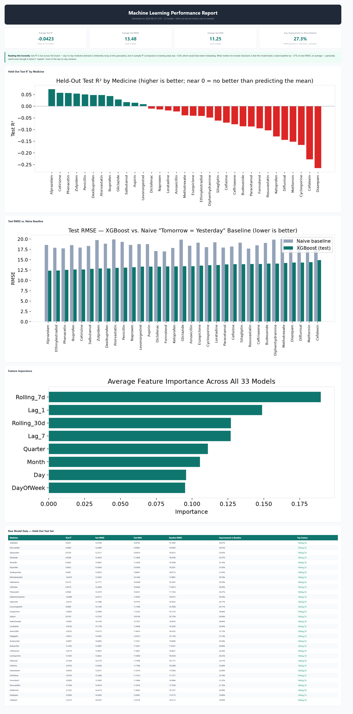

<div align="center">

# 💊 PharmaStock Optimizer

**AI-Powered Pharmaceutical Inventory Management & Demand Forecasting Platform**

[](https://python.org)
[](https://streamlit.io)
[](https://www.sqlalchemy.org)
[](https://xgboost.readthedocs.io)
[](https://docker.com)
[](#-testing)

---

*An industrial-grade inventory management system combining real-time stock tracking, interactive sales analytics, and XGBoost-based stockout prediction to optimize pharmaceutical supply chains.*

</div>

---

## 🎯 Why This Project Is Different

Most demo ML projects report one impressive-looking accuracy number and stop there. This one goes a step further: it checks whether that number can actually be trusted — and reports honestly when it can't.

- **Caught a real overfitting problem, and documented it instead of hiding it** — the first accuracy check looked great (R² ≈ 0.90), but that number came from testing the model on data it had already seen. Once tested properly on unseen data, that score dropped close to zero — a classic sign the model had memorized the past rather than learned to predict the future.
- **Proved the model is actually useful, instead of assuming it** — it's benchmarked against a simple "assume tomorrow looks like yesterday" guess, and beats it by **~27% on prediction error**, on the same unseen data. That's a concrete, honest number instead of a vague "it works."
- **The reasoning is fully visible, not just the code** — an [executed notebook](notebooks/eda_and_modeling.ipynb) walks through the data, the mistake that was caught, and the fix; the same results are also viewable live in the app's Model Insights page.

Full technical detail (train/test splitting, cross-validation, feature engineering) is in [Machine Learning](#-machine-learning) below.

---

## 📸 Screenshots

### 🔐 Secure Login


### 📊 Dashboard Overview
Real-time inventory metrics and color-coded stock levels across 33 medicines.


### 📦 Inventory Management
View and edit inventory with ML-predicted `Days_to_Stockout` for every medicine.

| View Inventory | Manage Inventory |
|:---:|:---:|
| 
 | 
 |

### 🛒 Orders & Payments
Shopping cart with live stock validation and automatic inventory deduction.


### 📈 Sales Analytics
Interactive filtering by date, month, or year — switch between bar and line chart views.

| Bar Chart View | Line Chart View |
|:---:|:---:|
| 
 | 
 |

### 💊 Medicine Reference
Per-medicine details: ATC code, uses, cautions, dosage, alternatives, and live stock count.


### 🏭 Supplier View
Medicines grouped by supplier with stock-level visualization.


---

## 📋 Table of Contents

- [Why This Project Is Different](#-why-this-project-is-different)
- [Overview](#-overview)
- [Architecture](#-architecture)
- [Machine Learning](#-machine-learning)
- [Tech Stack](#-tech-stack)
- [Key Features](#-key-features)
- [Getting Started](#-getting-started)
- [Project Structure](#-project-structure)
- [Database Schema](#-database-schema)
- [Security](#-security)
- [Testing](#-testing)
- [Docker Deployment](#-docker-deployment)
- [Contributing](#-contributing)
- [Author](#-author)

---

## 🔍 Overview

PharmaStock Optimizer addresses a critical challenge in pharmaceutical retail — **predicting when medicines will go out of stock** before it happens. Traditional inventory systems rely on static reorder points, but demand for medicines varies by season, external factors, and trends.

This platform integrates **XGBoost regression models** trained on 33,000+ historical sales records to dynamically predict stockout timelines, enabling pharmacies to:

- 🎯 **Proactively reorder** before critical shortages
- 📉 **Reduce wastage** from overstocking perishable medicines
- 📊 **Analyze sales trends** with interactive, filterable visualizations
- 🏢 **Manage supplier relationships** with per-supplier medicine mappings

---

## 🏗 Architecture

```
┌────────────────────────────────────────────────────────────────────────┐
│                          Streamlit UI (app.py)                         │
│ ┌─────────┐┌─────────┐┌───────┐┌────────┐┌──────┐┌──────────────────┐ │
│ │Dashboard││Inventory││ Sales ││Supplier││ Meds ││  Model Insights  │ │
│ │  Page   ││  Page   ││ Page  ││  Page  ││ Page ││       Page       │ │
│ └────┬────┘└────┬────┘└───┬───┘└───┬────┘└──┬───┘└─────────┬────────┘ │
├──────┼──────────┼─────────┼────────┼─────────┼─────────────┼──────────┤
│      │        Service Layer (services/)      │             │          │
│ ┌────▼──────┐┌───▼─────┐┌────▼─────┐┌───▼────┐│    ┌────────▼───────┐ │
│ │ Inventory ││  Sales  ││  Orders  ││Supplier││    │ ml/forecasting │ │
│ │  Service  ││ Service ││ Service  ││Service ││    │  (XGBoost)     │ │
│ └────┬──────┘└────┬────┘└────┬─────┘└───┬────┘│    └────────┬───────┘ │
├──────┼────────────┼──────────┼──────────┼──────┼─────────────┼────────┤
│      │         Data Layer                      │             │        │
│ ┌────▼────────────▼──────────▼──────────▼──┐┌──▼───┐┌────────▼──────┐ │
│ │       SQLAlchemy ORM (database/)          ││ JSON ││ Model registry│ │
│ │  Models: User │ Medicine │ Inventory │Sale││ Data ││ (ml_models/)  │ │
│ └──────────────────┬─────────────────────────┘└──────┘└───────────────┘ │
│                    │                                                   │
│ ┌──────────────────▼────────────────────────────────────────────────┐ │
│ │                       Cross-Cutting Concerns                      │ │
│ │           Auth (bcrypt+RBAC) │ Logging │ Config (Pydantic)        │ │
│ └─────────────────────────────────────────────────────────────────┘ │
└────────────────────────────────────────────────────────────────────────┘
```

A parallel FastAPI REST API (`api/`) shares the same service layer, so business logic is written once and used by both the UI and the API.

### Design Patterns

| Pattern | Implementation |
|---------|---------------|
| **Layered Architecture** | UI → Service → ORM → Database |
| **Repository Pattern** | Service classes abstract all data access |
| **Dependency Injection** | SQLAlchemy sessions injected into services |
| **Configuration as Code** | Pydantic `BaseSettings` with `.env` override |
| **Context Manager** | `get_session()` handles commit/rollback/close |

---

## 🤖 Machine Learning

### XGBoost Stockout Prediction

One XGBoost regression model per medicine (33 total) predicts daily sales
volume, then simulates forward day-by-day from current stock to estimate
**Days to Stockout**:

```
Features: Day index, day-of-week, month, quarter,
          7-/30-day rolling sales average, 1-/7-day lag
Output:   Predicted units sold for that day
Model:    XGBRegressor (100 estimators, squared error)
```

**Process:**
1. Train one model per medicine from historical sales data
2. Starting from current stock, iterate day-by-day subtracting predicted sales
3. Day count when stock reaches zero = **Days to Stockout**

**Safeguards:**
- Trained models cached in-process and keyed by a hash of the sales data, so
  a rerun only retrains when the underlying data actually changes
- 365-day iteration cap prevents infinite loops
- Negative predictions clamped to zero

### Validation Methodology

Forecasting demand is a time-series problem, and it's easy to get misleadingly
good numbers by evaluating a model on data it already memorized. This
pipeline evaluates honestly:

- **Chronological train/test split** — the most recent ~20% of each
  medicine's history is held out and never seen during training. Randomly
  shuffling time-ordered rows (a common mistake) would leak future
  information into the training set.
- **Time-series cross-validation** — uses `TimeSeriesSplit`, not a random
  K-fold, so every validation fold trains only on the past and validates on
  the future.
- **Naive baseline comparison** — every model is compared against a
  "tomorrow = yesterday" baseline evaluated on the *same* held-out window, so
  the model's value is quantified rather than assumed.
- **Final refit on all data** — after honest evaluation, the model used for
  actual predictions is refit on the complete dataset (train + test), which
  is standard practice: hold out data to validate, then retrain on
  everything once validated.

### Results

Across all 33 medicines, in-sample R² looks strong (~0.90), but the honest
held-out test R² is close to zero — a real overfitting signature that only
proper time-based validation catches. Despite that, the model beats the
naive baseline by **~27% on test RMSE, on average**, meaning it's still
decision-useful for reorder timing even though per-medicine daily demand is
too noisy for any model tried here to explain most of its variance.

The full walkthrough — EDA, feature engineering, the overfitting finding,
and a head-to-head against a Linear Regression baseline — is in
[`notebooks/eda_and_modeling.ipynb`](notebooks/eda_and_modeling.ipynb). The
same results are also browsable live in the app's **Model Insights** page.



---

## 🛠 Tech Stack

| Layer | Technology | Purpose |
|-------|-----------|---------|
| **Frontend** | Streamlit | Interactive web UI |
| **Visualization** | Plotly Express | Interactive charts |
| **ORM** | SQLAlchemy 2.0 | Database abstraction |
| **Database** | SQLite (WAL mode) | Relational storage |
| **Validation** | Pydantic v2 | Input/config validation |
| **Machine Learning** | XGBoost + scikit-learn | Stockout forecasting + validation |
| **Authentication** | bcrypt | Salted password hashing |
| **Configuration** | pydantic-settings | Environment management |
| **Testing** | pytest | Unit test suite |
| **Containerization** | Docker | Production deployment |

---

## ✨ Key Features

### 📊 Dashboard
Real-time inventory overview with color-coded stock charts and KPI cards (total medicines, low stock, expired).

### 📦 Inventory Management
CRUD operations with AI-powered stockout prediction on every update.

### 🛒 Orders & Payments
Shopping cart with cumulative stock validation and automatic inventory deduction.

### 📈 Sales Analytics
Filter by date / month / year with interactive bar and line charts across 33,000+ sales records.

### 🏭 Supplier Management
View medicines grouped by supplier with stock visualizations.

### 💊 Medicine Reference
33 medicines with ATC codes, dosage, cautions, alternatives, and real-time stock display.

### 🧠 Model Insights
Held-out test metrics, baseline comparison, and feature importance for the forecasting models — no log-diving required.

### 🔐 Authentication & RBAC
bcrypt hashing, role-based access (admin/user), session timeout, email recovery.

---

## 🚀 Getting Started

### Prerequisites
- **Python 3.10+**
- **pip** package manager

### Installation

```bash
# Clone the repository
git clone https://github.com/Suresh-Note/pharma-stockout-forecasting.git
cd pharma-stockout-forecasting

# Install dependencies
pip install -r requirements.txt

# Configure environment
cp .env.example .env
# Edit .env with your SMTP credentials (optional) and Postgres password (only for Docker)
```

### Configure `.env`

```env
SMTP_EMAIL=your_email@gmail.com
SMTP_PASSWORD=your_gmail_app_password
```

### Run

```bash
# Run the modular app
streamlit run app.py

# Or run the legacy single-file version
streamlit run PharmaStock.py
```

### Run Tests

```bash
python -m pytest tests/ -v
```

---

## 📁 Project Structure

```
pharma-stockout-forecasting/
├── app.py                          # Entry point (thin router)
├── config.py                       # Centralized Pydantic settings
├── PharmaStock.py                  # Legacy single-file version
│
├── database/                       # Data access layer
│   ├── connection.py               # SQLAlchemy engine + session factory
│   └── models.py                   # ORM models (User, Medicine, Inventory, Sale)
│
├── auth/                           # Authentication module
│   ├── security.py                 # bcrypt hashing + session management
│   ├── email.py                    # SMTP email service
│   └── service.py                  # Auth orchestration (register/login/delete)
│
├── services/                       # Business logic layer
│   ├── inventory.py                # Inventory CRUD + summary
│   ├── sales.py                    # Sales filtering + queries
│   ├── orders.py                   # Cart management + order processing
│   └── suppliers.py                # Supplier-medicine mappings
│
├── ml/                             # Machine learning pipeline
│   └── forecasting.py              # XGBoost training + honest time-based evaluation
│
├── notebooks/
│   └── eda_and_modeling.ipynb      # EDA, feature engineering, model evaluation walkthrough
│
├── pages_ui/                       # Streamlit page modules
│   ├── dashboard.py                # Dashboard view
│   ├── inventory_page.py           # Inventory management
│   ├── sales_page.py               # Sales analytics
│   ├── medicines_page.py           # Medicine reference
│   ├── suppliers_page.py           # Supplier view
│   └── model_insights.py           # ML test metrics + feature importance
│
├── utils/                          # Cross-cutting utilities
│   ├── logger.py                   # Structured logging
│   ├── exceptions.py               # Custom exception hierarchy
│   └── validators.py               # Pydantic input schemas
│
├── data/
│   ├── medicines_info.json         # Medicine reference data
│   └── expanded_sales_data.csv     # Historical sales dataset (33K rows)
│
├── tests/                          # pytest test suite (31 tests)
│   ├── conftest.py                 # Fixtures (in-memory DB, sample data)
│   ├── test_auth.py                # Auth service tests
│   ├── test_inventory.py           # Inventory CRUD tests
│   └── test_forecasting.py         # ML prediction tests
│
├── Dockerfile                      # Production container
├── docker-compose.yml              # Container orchestration
├── requirements.txt                # Python dependencies
├── .env.example                    # Environment variable template
├── .env                            # Environment secrets (not committed)
└── .gitignore                      # Git exclusions
```

---

## 🗄 Database Schema

### `Inventory` — Current stock levels (33 medicines)

| Column | Type | Description |
|--------|------|-------------|
| Medicine_Name | TEXT (PK) | Medicine identifier |
| ATC_Code | TEXT | ATC classification |
| Stock_Available | INTEGER | Current units in stock |
| Price_per_Unit | REAL | Current price |
| Reorder_Level | INTEGER | Low-stock threshold |
| Days_to_Stockout | INTEGER | ML-predicted days |
| Expiry_Date | DATE | Batch expiry |

### `Sales` — Historical records (~33,000 rows)

| Column | Type | Description |
|--------|------|-------------|
| Date | TEXT | Sale date (YYYY-Mon-DD) |
| Month | TEXT | Full month name |
| Year | INTEGER | Sale year |
| Medicine_Name | TEXT | Medicine identifier |
| Stock_Sold | INTEGER | Units sold |
| External_Factor | TEXT | Demand factor |

### `users` — Registered accounts (RBAC-enabled)

| Column | Type | Description |
|--------|------|-------------|
| username | TEXT (PK) | Unique identifier |
| email | TEXT | Recovery email |
| password | TEXT | bcrypt hash |
| role | TEXT | "admin" or "user" |
| created_at | DATETIME | Registration timestamp |

---

## 🔐 Security

| Feature | Implementation |
|---------|---------------|
| **Password Hashing** | bcrypt with configurable rounds (default: 12) |
| **RBAC** | Admin/user roles stored in database |
| **Session Timeout** | Configurable expiry (default: 30 minutes) |
| **Credential Storage** | `.env` file, excluded from Git |
| **SQL Injection** | SQLAlchemy parameterized queries |
| **Custom Exceptions** | Structured error hierarchy (never leaks internals) |

---

## 🧪 Testing

**31 tests** covering 3 modules:

| Module | Tests | Coverage |
|--------|-------|----------|
| `test_auth.py` | 11 | Password hashing, register, login, delete, RBAC |
| `test_inventory.py` | 9 | CRUD, stock deduction, summary, properties |
| `test_forecasting.py` | 11 | Feature engineering, model persistence, bounds, clamping, mock predictions |

```bash
python -m pytest tests/ -v
# ======================= 31 passed in 11.25s ========================
```

Tests use **in-memory SQLite** databases — no effect on production data.

---

## 🐳 Docker Deployment

```bash
# Build and run
docker-compose up --build

# Or manually
docker build -t pharmastock .
docker run -p 8501:8501 --env-file .env pharmastock
```

The container includes a health check endpoint at `/_stcore/health`.

---

## 🤝 Contributing

1. Fork the repository
2. Create a feature branch (`git checkout -b feature/your-feature`)
3. Run tests (`python -m pytest tests/ -v`)
4. Commit changes (`git commit -m 'Add your feature'`)
5. Push and open a Pull Request

---

## 👨‍💻 Author

**Suresh Kanchamreddy**

[](https://github.com/Suresh-Note)
[](https://linkedin.com/in/suresh-kanchamreddy)

---

<div align="center">

**Built with ❤️ using Streamlit · SQLAlchemy · XGBoost · Pydantic · Docker**

</div>
